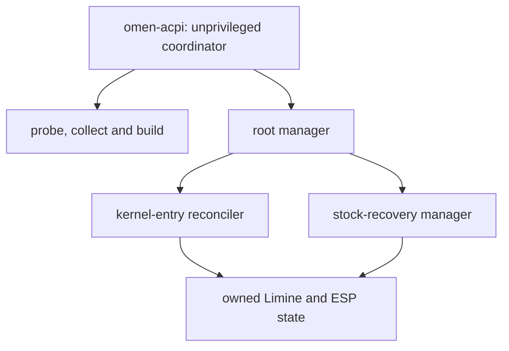

# Code overview

The ACPI change itself is small. Most of the repository exists to answer the
harder operational question: how can a DSDT collected from one machine be
transformed, verified, loaded for one reversible test boot and later removed
without confusing it with stock, foreign or partially modified state?

The code should therefore be read as a protected pipeline around the
transformation, not as a collection of unrelated scripts. This note follows
that pipeline and explains where each safety boundary lives. Operational and
recovery instructions remain in the main README and the usage guide.

## Reading path

For a first pass, read these files in order:

1. `omen-acpi`: public command, dashboard and workflow coordinator.
2. `scripts/00-probe-boot.sh`: classification of the DSDT active in the current
   boot.
3. `scripts/02-build-dsdt.sh`: the two normalized ACPI transformations and their
   checks.
4. `scripts/03-manage-limine-entry.sh`: privileged installation, status and
   removal rules.
5. `scripts/04-stock-recovery.py`: preventive stock snapshot and recovery
   transactions.
6. `scripts/05-kernel-entries.py`: reconciliation of standard and LTS Limine
   entries.

The transformation itself is concentrated in `02-build-dsdt.sh`. The larger
manager and recovery files mainly protect paths, ownership and transaction
boundaries around that transformation.

## Components and privileges

| Component                    | Runs as                                 | Responsibility                                                       | Persistent writes                                                            |
| ---------------------------- | --------------------------------------- | -------------------------------------------------------------------- | ---------------------------------------------------------------------------- |
| `omen-acpi`                  | normal user                             | prompts, dependency checks and workflow order                        | private artifacts and small pointers below the user's data/state directories |
| `00-probe-boot.sh`           | root                                    | read-only classification of the live DSDT, taint and boot evidence   | none                                                                         |
| `01-collect-acpi.sh`         | normal user, with restricted root calls | collect and decompile the machine's own ACPI tables                  | private source archive in the user's artifact directory                      |
| `02-build-dsdt.sh`           | normal user                             | transform, compile and verify one DSDT variant                       | private build archive                                                        |
| `03-manage-limine-entry.sh`  | root                                    | validate a build, manage owned state and invoke entry reconciliation | reserved toolkit paths on the ESP and under `/var/lib`                       |
| `04-stock-recovery.py`       | root                                    | create, verify, use and remove the preventive stock snapshot         | reserved recovery paths and, only when needed, one owned Limine block        |
| `05-kernel-entries.py`       | root                                    | keep owned entries aligned with installed standard/LTS kernels       | owned Limine blocks, one early CPIO and its manifest                         |
| `install.sh`, `uninstall.sh` | root after re-exec                      | transactional installation below `/usr/local`                        | installed program, command and documentation                                 |
| `update.sh`                  | normal user until installation          | verify a release archive and call the installer                      | download cache; installation is delegated to `install.sh`                    |

The public frontend must not run as root. It asks for `sudo` only when one of
the internal engines needs privileged reads or writes.



## Guided setup

`omen-acpi setup s5`, `setup combined` and `setup both` follow the same order:

1. Read the DMI product, board and BIOS.
2. Require the exact reference identity or obtain the explicit
   unvalidated-machine opt-in.
3. Inspect the current boot and require a clean stock DSDT.
4. Check or install the operation's dependencies.
5. Prepare a preventive stock snapshot from one usable normal entry.
6. Collect and fingerprint the local DSDT.
7. Build the selected variant and verify its structure, AML header, checksum and
   round trip.
8. Install the verified AML into owned state.
9. Reconcile one experimental entry for each detected primary CachyOS kernel.
10. Leave reboot and entry selection to the user.

If setup begins from an experimental boot, the frontend records a small pending
action and asks the user to return to stock. It resumes only after the boot ID
changes and the stock probe succeeds.

## The two transformations

Both variants begin with the exact stock DSDT header and `_PTS` body expected
from board `8E35`, BIOS `F.13`. Occurrence counts must match before any
replacement is made.

The `s5` variant adds the S5-only sequence

```asl
Store (0x03, \_SB.PCI0.GPP0.PEGP.OMPR)
\_SB.PCI0.GPP0.PEGP._PS3 ()
```

inside the existing `_PTS` method when `Arg0 == 5`.

The `combined` variant performs the same change and separately bounds two
`WQBZ` loops before `BF01[Local5]` is read. Here `BF01` is the source buffer and
`Local5` is the method-local integer used as its current index. The stock loop
can evaluate `BF01[0x32]` even though a `0x32`-byte buffer ends at index `0x31`.
Combined requires `Local5 < SizeOf(BF01)` before that dereference and then
retains the original zero-byte stopping rule.

The builder checks that only the intended method bodies and OEM revision
changed. It compiles the result with `iasl`, verifies the AML header and
checksum, decompiles it again and checks the reconstructed semantics. The full
call-chain derivation and exact before/after loops are in
[`../patches/README.md`](../patches/README.md).

No reference-machine AML is stored in the repository. Every build begins from
the target machine's locally collected source.

## State model

The toolkit does not use one global “installed” flag. Decisions combine several
independently checked states:

| State            | Typical values                                                 | Used for                               |
| ---------------- | -------------------------------------------------------------- | -------------------------------------- |
| Machine identity | reference, opted-in, unreadable                                | whether a transformation may start     |
| Active boot      | stock, S5, Combined, unknown, unavailable                      | whether collection or mutation is safe |
| Variant format   | absent, managed, legacy, conflict                              | install, refresh and removal decisions |
| Kernel entry     | current, missing, obsolete, conflict                           | standard/LTS reconciliation            |
| Stock snapshot   | valid, refresh-required, missing, stale, modified, unavailable | recovery and removal decisions         |

Ambiguous or modified state is not repaired automatically. The relevant command
stops and preserves the files for inspection.

## Ownership and transaction rules

The mutating engines use a shared lock and reserved names. Before replacing or
deleting anything they check, as appropriate:

- path type, owner, permissions and hard-link count;
- machine identity and active DSDT state;
- recorded and current SHA-256 or BLAKE2 fingerprints;
- the exact owned Limine block and manifest;
- stability of the source and configuration across expensive checks;
- absence of unexpected staging or backup paths.

Writes are staged first. A failed operation restores the previous owned state
when it can prove that neither the original nor the staged object changed
concurrently. Foreign or ambiguous content is preserved instead of being
overwritten.

## Why some files are large

`omen-acpi` and `03-manage-limine-entry.sh` are long, but they have different
roles. The first keeps the user-visible state machine in one place. The second
keeps privileged Limine mutation, legacy recognition and rollback under one lock
and one command boundary.

The code uses small named functions inside those files and delegates the two
data-heavy state models to Python. Splitting the root manager further would be
reasonable only with the same fail-closed behavior, release manifest, migration
coverage and byte-identical ACPI output. A cosmetic split alone would not
justify changing a hardware-validated path.

Section comments in the large files mark the main groups: preconditions,
transformation, legacy parsing, managed ownership, actions and command dispatch.

## rEFInd companion

`scripts/06-refind-s5.sh` is outside the Limine pipeline. It calls the collector
and the DSDT builder, then appends one rEFInd stanza. It does not call
`03-manage-limine-entry.sh`, and it is not part of the release archive. Its
stock-return and driver limits are in [`refind.md`](refind.md).

## Tests

`tests/run.sh` is the repository entry point. It covers:

- Bash syntax and embedded Python compilation;
- version and reference-identity consistency;
- CLI and interactive-menu behavior;
- boot-state and installation classification;
- exact S5 and Combined transformation fixtures;
- unvalidated-machine opt-in boundaries;
- stock-recovery ownership, rollback and race cases;
- standard/LTS reconciliation and migration;
- the `NVDE` analysis self-test when repository-only documentation is present;
- the rEFInd stanza edit, when the repository-only companion is present;
- release manifest, reproducibility and updater verification.

These tests use synthetic filesystems and command doubles. They do not replace
the hardware observations recorded in [`validation.md`](validation.md).

## Development boundary

The Bash and Python implementation is substantially AI-assisted. The precise
division between Paolo De Marinis's direction and validation and OpenAI Codex's
implementation support is stated in the README. That disclosure is part of the
technical documentation because it defines what kind of review and assurance the
repository can claim.
